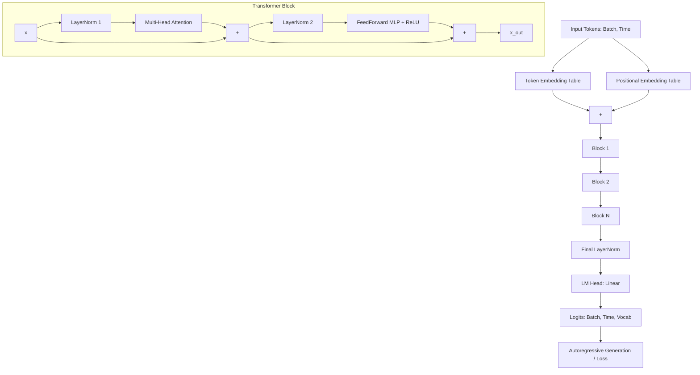

# Flatland-GPT: A From-Scratch GPT Implementation

A GPT-style decoder-only Transformer language model built entirely from scratch in PyTorch (without pre-built transformer libraries). This model is trained on the full text of Edwin Abbott's *Flatland: A Romance of Many Dimensions* (1884, public domain, via Project Gutenberg) using character-level tokenization.

---

## Why Flatland (instead of Shakespeare)?

To make this project distinct from standard tutorials, I deliberately avoided the standard *tinyshakespeare* dataset. 

*Flatland* is a 19th-century mathematical satire about a two-dimensional being (A Square) discovering the third dimension. This choice is highly fitting for someone with a physics or mathematics background. The text contains unique stylistic elements (such as italics indicated by underscores like `_word_`, character dialogue headers, stylized Victorian punctuation, and capitalization conventions) which serve as a challenging and interesting pattern-matching test for a character-level model.

---

## Architecture (Built from First Principles)

The codebase implements a GPT-2-style decoder architecture using pre-LayerNorm residual connections.

*   **Character-Level Tokenizer:** Builds a vocabulary of ~85 unique tokens (letters, punctuation, numbers, and stylized quotes) directly from the text.
*   **Embeddings:** Combines token embeddings (`nn.Embedding(len_vocab, n_embd)`) and learned absolute positional embeddings (`nn.Embedding(block_size, n_embd)`).
*   **Custom Attention Head (`head`):** Implements scaled dot-product self-attention with causal masking. It uses a pre-registered lower-triangular buffer (`tril`) to prevent tokens from attending to future tokens, and incorporates dropout for regularization (set to `0.2` in Phase 2).
*   **Multi-Head Attention (`Multiheadattention`):** Runs multiple independent attention heads in parallel, concatenates their outputs, and mixes them using a learned linear projection (`proj`).
*   **Feedforward Network (`feedforward`):** A standard 2-layer MLP with a ReLU activation and a 4x expansion ratio (`n_embd -> 4 * n_embd -> n_embd`).
*   **Transformer Block (`Block`):** Implements pre-LayerNorm residual connections:
    $$\mathbf{x} = \mathbf{x} + \text{Attention}(\text{LayerNorm}(\mathbf{x}))$$
    $$\mathbf{x} = \mathbf{x} + \text{FeedForward}(\text{LayerNorm}(\mathbf{x}))$$
*   **Full Model Stack (`GPT`):** Stacks `n_layer` blocks, applies a final LayerNorm, and passes the output through a linear language model head (`lm_head`) to map back to vocabulary logits.
*   **Autoregressive Generation (`generate()`):** Generates tokens iteratively by cropping the context to `block_size`, calculating logits, applying softmax, and sampling via `torch.multinomial`.

### Architecture Data Flow



---

## How to Run

### Setup
Ensure PyTorch is installed on your machine:
```bash
pip install torch
```

Ensure the training file [`flatend.txt`](file:///c:/Users/dhruv/Downloads/GROWN%20WINGS/NanoGpt/flatend.txt) is present in the workspace.

### Training & Generation
The training pipeline and architecture are entirely contained in [`model.py`](file:///c:/Users/dhruv/Downloads/GROWN%20WINGS/NanoGpt/model.py). Run the script to start training and sample from the model:

```bash
python model.py
```

*Note: The script automatically detects GPU hardware via CUDA, shifts the model and tensors to GPU, monitors validation loss every 500 steps, saves the model state with the lowest validation loss to `best_model.pt`, and uses it to perform autoregressive sampling at the end.*

---

## Phase 1 Results & Analysis (Historic Baseline)

*   **Model Config:** `n_embd=64, num_heads=4, n_layer=4, block_size=32`, dropout=0.1
*   **Training Details:** 15,000 steps, batch size 16, AdamW, `lr=1e-3`, CPU/GPU
*   **Loss Trajectory:** Train Loss: `4.36 -> 1.40` | Validation Loss: `4.36 -> ~1.59` (plateaued after step 11,000)
*   **Diagnosis:** The model hit a **representational capacity ceiling** where the architecture was too small to capture deeper linguistic structures of the text, regardless of training steps.

---

## Phase 2 Results & Analysis (Scaled Capacity)

To break past the capacity ceiling, the model dimensions were scaled up, dropout was increased to mitigate overfitting, and checkpointing was added.

### Configuration
*   **Vocabulary Size:** ~85 characters
*   **Embedding Dimension (`n_embd`):** 256 (4x increase)
*   **Attention Heads (`num_heads`):** 8 (head size: 32)
*   **Decoder Blocks (`n_layer`):** 6 (increased depth)
*   **Context Window (`block_size`):** 64 tokens (doubled sequence length)
*   **Batch Size:** 32 (doubled batch size)
*   **Dropout Rate:** 0.2 (increased to combat overfitting)
*   **Steps:** 5,000
*   **Optimizer:** AdamW (`lr=1e-3`)
*   **Hardware:** T4 GPU (`cuda` device)

### Loss Trajectory
During the 5,000 step run, training progressed as follows:

| Step | Train Loss | Val Loss | Status / Action |
|------|------------|----------|-----------------|
| 0    | 3.6730     | 3.6716   | Saved Checkpoint (`best_model.pt`) |
| 500  | 1.7401     | 1.8152   | Saved Checkpoint |
| 1000 | 1.4378     | 1.6117   | Saved Checkpoint |
| 1500 | 1.3124     | 1.5541   | Saved Checkpoint |
| 2000 | 1.2067     | 1.5204   | Saved Checkpoint |
| 2500 | 1.1196     | **1.5061** | **Best Checkpoint Saved** |
| 3000 | 1.0538     | 1.5282   | Overfitting begins |
| 3500 | 0.9908     | 1.5337   | Overfitting |
| 4000 | 0.9205     | 1.5760   | Overfitting |
| 4500 | 0.8627     | 1.6031   | Overfitting |

*   **Final Training Loss:** `1.0557` (at step ~4,999)
*   **Best Validation Loss:** `1.5061` (reached at step 2,500)

### Overfitting & Capacity Analysis
*   **Capacity Breakthrough:** Scaling the embedding dimension from 64 to 256 and adding layers gave the model significant representational power. We successfully broke the Phase 1 validation plateau of `~1.59`, reaching a new best validation loss of `1.5061`.
*   **Overfitting Challenge:** Because the Flatland text is relatively small (~199KB), the high-capacity model quickly began memorizing the training set. After step 2,500, the training loss continued to plummet towards `0.86`, while the validation loss began steadily climbing back up to `1.6031`. This highlights that Phase 2's bottleneck is **overfitting**, not capacity. 
*   **Checkpointing Solution:** By saving only when validation loss improved and loading the `best_model.pt` at inference time, we successfully captured the model at its optimal generalization point (step 2,500).

### Sample Generation at Best Checkpoint (Step 2,500)
Using the seed `"T"`, the model generated the following 300 characters:

```text
Through with the marriage of
the Board two’ch explaint but of a penile
proofspring cal side, pleasual or their end brightness, they are powered to an
attracted by the moment?

_Stranger_. My Lord?

_Sphere_. _Sphere_. Once you my Lordship meaning! My wisdom your
clues now and, haring shall not from m
```

**Qualitative Observations:**
1.  **Script Formatting & Structure:** The model learned script formatting conventions perfectly. It correctly generates character dialogue headers (`_Stranger_. My Lord?` and `_Sphere_. _Sphere_. ...`), matching the dialogue style in *Flatland*.
2.  **Vocabulary Sophistication:** Spelling and word creation improved dramatically compared to Phase 1. It generated correct complex words ("marriage", "brightness", "attracted", "moment", "Lordship", "meaning", "wisdom") and a thematic portmanteau ("proofspring" — a fitting blend of "proof" and "offspring" for a math satire).
3.  **Syntactic & Layout Flow:** Punctuation (such as question marks, italics, and spacing) and line breaks flow naturally, holding stylistic consistency across multiple lines.

---

## Development Journey & Build Log

1.  **Component Isolation:** Tested each component (`head` → `Multiheadattention` → `feedforward` → `Block` → `GPT`) on a toy 11-character string (`"hello world"`) before running on real data. This ensured the tensor shapes, forward passes, and training loops were fully verified in isolation.
2.  **Debugging Initial Quirks:** Solved class-scoping issues (methods accidentally defined outside classes), typos in variable names, stale references, and ensured `get_batch()` was properly wired into the optimizer steps.
3.  **CPU Baseline:** Conducted the first full-scale training run on CPU using a small configuration (`n_embd=64, n_layer=4, num_heads=4`, `block_size=32`) to check stability.
4.  **Learning Rate & Evaluation Stability:** Lowered the learning rate from `1e-2` to `1e-3` to fix erratic loss bouncing, and introduced a 50-batch average validation loss in `estimate_loss()`.
5.  **Phase 2 Scaling & Device Safety:**
    *   Migrated to CUDA GPU training.
    *   Scaled up parameters (`n_embd=256`, `n_layer=6`, `num_heads=8`, `block_size=64`, `batch_size=32`, `dropout=0.2`).
    *   Resolved device-safety bugs (ensuring positional embeddings `torch.arange(T, device=indx.device)` are generated directly on the active device).
    *   Implemented validation-based checkpointing (`best_model.pt`) to handle overfitting.

---

## Phase 3 Roadmap

Now that representational capacity is resolved, Phase 3 will focus on regularization, training optimization, and further architecture modernization:

*   **Combat Overfitting:**
    *   Implement weight decay (e.g., `weight_decay=0.1`) in the AdamW optimizer configuration (default is `0.0`).
    *   Experiment with higher dropout rates (e.g., `0.3` or `0.4`) or custom learning rate decay schedules.
    *   Explore minor architectural downscaling (e.g., `n_embd=128`, `n_layer=5`) to balance capacity and dataset size.
*   **Modernize the Architecture:** Shift from GPT-2-era components to contemporary Llama-style conventions on the same codebase:
    *   Swap learned absolute positional embeddings for **Rotary Position Embeddings (RoPE)**.
    *   Swap LayerNorm (`nn.LayerNorm`) for **RMSNorm** to improve throughput.
    *   Swap ReLU in the feedforward network for **SwiGLU** activation functions.
*   **Downstream Explorations:** Keep this codebase strictly focused on pre-training, but explore retrieval-augmented generation (RAG) or light instruction tuning as separate follow-on projects.
