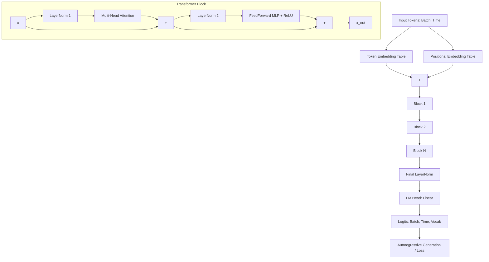

# Flatland-GPT: A From-Scratch GPT Implementation

A GPT-style decoder-only Transformer language model built entirely from scratch in PyTorch (without pre-built transformer libraries). This model is trained on the full text of Edwin Abbott's *Flatland: A Romance of Many Dimensions* (1884, public domain, via Project Gutenberg) using character-level tokenization.

---

## Why Flatland (instead of Shakespeare)?

To make this project distinct from standard tutorials, I deliberately avoided the standard *tinyshakespeare* dataset. 

*Flatland* is a 19th-century mathematical satire about a two-dimensional being (A Square) discovering the third dimension. This choice is highly fitting for someone with a physics or mathematics background. The text contains unique stylistic elements (such as italics indicated by underscores like `_word_`, stylized Victorian punctuation, and capitalization conventions) which serve as a challenging and interesting pattern-matching test for a character-level model.

---

## Architecture (Built from First Principles)

The codebase implements a GPT-2-style decoder architecture using pre-LayerNorm residual connections.

*   **Character-Level Tokenizer:** Builds a vocabulary of ~85 unique tokens (letters, punctuation, numbers, and stylized quotes) directly from the text.
*   **Embeddings:** Combines token embeddings (`nn.Embedding(len_vocab, n_embd)`) and learned absolute positional embeddings (`nn.Embedding(block_size, n_embd)`).
*   **Custom Attention Head (`head`):** Implements scaled dot-product self-attention with causal masking. It uses a pre-registered lower-triangular buffer (`tril`) to prevent tokens from attending to future tokens, and incorporates dropout for regularization.
*   **Multi-Head Attention (`Multiheadattention`):** Runs multiple independent attention heads in parallel, concatenates their outputs, and mixes them using a learned linear projection (`proj`).
*   **Feedforward Network (`feedforward`):** A standard 2-layer MLP with a ReLU activation and a 4x expansion ratio (`n_embd -> 4 * n_embd -> n_embd`).
*   **Transformer Block (`Block`):** Implements pre-LayerNorm residual connections:
    $$\mathbf{x} = \mathbf{x} + \text{Attention}(\text{LayerNorm}(\mathbf{x}))$$
    $$\mathbf{x} = \mathbf{x} + \text{FeedForward}(\text{LayerNorm}(\mathbf{x}))$$
*   **Full Model Stack (`GPT`):** Stacks `n_layer` blocks, applies a final LayerNorm, and passes the output through a linear language model head (`lm_head`) to map back to vocabulary logits.
*   **Autoregressive Generation (`generate()`):** Generates tokens iteratively by cropping the context to `block_size`, calculating logits, applying softmax, and sampling via `torch.multinomial`.

### Architecture Data Flow



---

## How to Run

### Setup
Ensure PyTorch is installed on your machine:
```bash
pip install torch
```

Ensure the training file [`flatend.txt`](file:///c:/Users/dhruv/Downloads/GROWN%20WINGS/NanoGpt/flatend.txt) is present in the workspace.

### Training & Generation
The training pipeline and architecture are entirely contained in [`model.py`](file:///c:/Users/dhruv/Downloads/GROWN%20WINGS/NanoGpt/model.py). Run the script to start training and sample from the model:

```bash
python model.py
```

*Note: The script automatically handles splitting the dataset (90% training, 10% validation), training on the selected hardware device (automatically migrating tensors to GPU if available), and performing autoregressive sampling at the end.*

---

## Phase 1 Results & Analysis

### Configuration
*   **Vocabulary Size:** ~85 characters
*   **Embedding Dimension (`n_embd`):** 64
*   **Attention Heads (`num_heads`):** 4 (individual head size: 16)
*   **Decoder Blocks (`n_layer`):** 4
*   **Context Window (`block_size`):** 32 tokens
*   **Batch Size:** 16
*   **Steps:** 15,000
*   **Optimizer:** AdamW (`lr=1e-3`)
*   **Hardware:** Google Colab T4 GPU

### Loss Trajectory & The Capacity Ceiling
*   **Initial Loss:** `4.36` (both train and validation)
*   **Final Loss:** Train Loss: `1.40` | Validation Loss: `~1.59`
*   **Observations:** The validation loss plateaued in the `1.57 - 1.62` range from roughly step 11,000 onward. Meanwhile, the training loss continued to slowly decrease, widening the train-val gap to `~0.19` by the end of training.
*   **Diagnosis:** The model reached the **representational capacity ceiling** of a 64-dimensional, 4-layer architecture. Further training steps alone would not yield better generalization on this dataset. To break through this limit, the model architecture needs to be scaled up (higher `n_embd`, more layers, more heads).

### Sample Generation at Step 15,000
Using the seed `"T"`, the model generated the following 300 characters:

> "Tediral of their me, but all be at knowleed." seed not I were to be diffull. _voiese of hope easy fascent help castomens or would even rhibible. Seection is of them the furility orpation of Stranges in all then some then you for tope infelsion. West Circle, and besided Sight the Clour Caperations of

**Qualitative Observations:**
1.  **Word-level Coherence:** The model correctly forms common English words ("of", "their", "but", "all", "were", "would", "even", "and") and creates phonetically believable "invented" words ("knowleed", "castomens", "rhibible").
2.  **Syntax & Formatting:** The model has successfully learned sentence mechanics, including capitalizations, periods, spaces, and quotation marks.
3.  **Style Learning:** It correctly adopted the dataset's underscore italics notation (`_voiese_` style), showing that it captured raw formatting characteristics of the Project Gutenberg source file.
4.  **Limits:** Grammatical coherence over long distances is weak, and spelling errors are prevalent on rarer words. This is standard behavior at a validation loss of ~1.59; full coherence typically requires a loss in the `1.0 - 1.3` range.

---

## Development Journey & Build Log

1.  **Component Isolation:** Tested each component (`head` → `Multiheadattention` → `feedforward` → `Block` → `GPT`) on a toy 11-character string (`"hello world"`) before running on real data. This ensured the tensor shapes, forward passes, and training loops were fully verified in isolation.
2.  **Debugging Initial Quirks:** Solved class-scoping issues (methods accidentally defined outside classes), typos in variable names, stale references, and ensured `get_batch()` was properly wired into the optimizer steps.
3.  **CPU Baseline:** Conducted the first full-scale training run on CPU using a small configuration (`n_embd=64, n_layer=4, num_heads=4`, `block_size=32`) to check stability.
4.  **Learning Rate & Evaluation Stability:**
    *   Initially tried a learning rate of `1e-2`, which caused the training loss to bounce erratically and plateau around `1.7 - 2.0`.
    *   Fixed this by lowering the learning rate to `1e-3`.
    *   Implemented `estimate_loss()` to average losses over 50 iterations, replacing noisy single-batch loss printouts with a smooth, reliable signal for validation tracking.
5.  **Scaling with GPU:** Migrated training to a Google Colab T4 GPU, extending the run to 15,000 steps and revealing the representational ceiling of the Phase 1 configuration.

---

## Phase 2 Roadmap

With the training pipeline validated and running on GPU, Phase 2 will focus on scaling model capacity and modernizing the architecture:

*   **Scale Up Parameters:** Increase the size of `n_embd`, `n_layer`, and `num_heads` to push past the current representational capacity ceiling.
*   **Modernize the Architecture:** Shift from GPT-2-era components to contemporary Llama-era conventions on the same codebase:
    *   Swap learned absolute positional embeddings for **Rotary Position Embeddings (RoPE)**.
    *   Swap LayerNorm (`nn.LayerNorm`) for **RMSNorm** to improve throughput.
    *   Swap ReLU in the feedforward network for **SwiGLU** activation functions.
*   **Downstream Explorations:** Keep this codebase strictly focused on pre-training, but explore retrieval-augmented generation (RAG) or light instruction tuning as separate follow-on projects.
